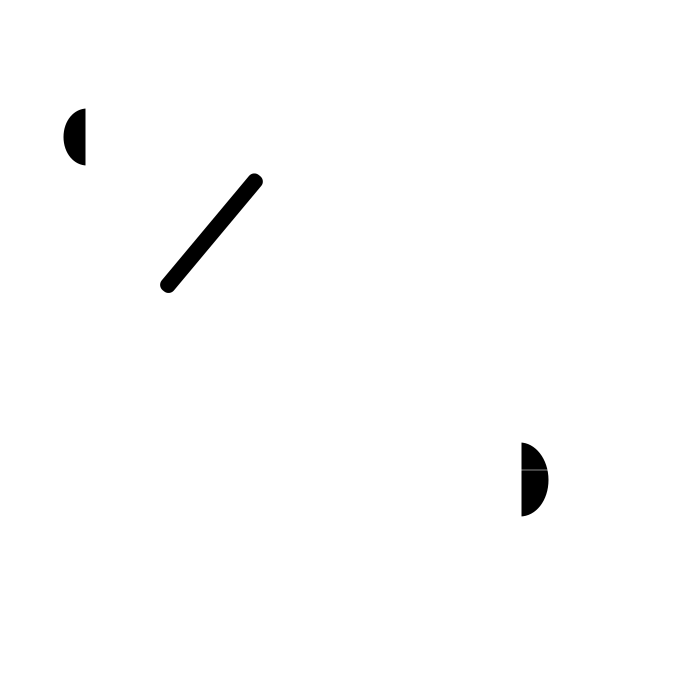

---
# Feel free to add content and custom Front Matter to this file.
# To modify the layout, see https://jekyllrb.com/docs/themes/#overriding-theme-defaults

layout: blox
# title: 

fond:
  image-fader:
    class: bg-cover bg-anim

# Hero
hero:
  container:
    type: fluid content
    # class: center-text
    columns:
      - size: 6 col-md-12
        # class: content
        content: |
          
      
      - size: 6 col-md-12
        # class: content
        content: |
          ## Mathieu **Sarrazy**
          {: .animate__animated .animate__fadeInDown data-body-bg="./medias/w1920/Acceuil.jpg" }
          
          Technicien, accordeur / restaurateur de piano
          {: .animate__animated .animate__fadeInUp}
          
          Diplômé de l’école [Ignace Pleyel à Loos (59)](https://ecole-regionale-deficients-visuels.enthdf.fr/metier-dart-accordeur-de-piano/)
          {: .animate__animated .animate__fadeInUp}
          
          [Contactez moi](#contact){: .btn .animate__animated .animate__fadeInUp .scrollto}

# sm md lg xl xxl 
# hero:
#   center-text:
#     image: ./medias/w1920/Acceuil.jpg
#     content: |
#       

#         

      
#       
#       {: .logo.col-lg-6.col-md-12 }
      
#       

#       

      
#       ## Mathieu **Sarrazy**
      
#         

#       

      
#       
#       {: .logo.col-lg-6.col-md-12 }
#       ## Mathieu **Sarrazy**
#       {: .animate__animated .animate__fadeInDown data-body-bg="./medias/w1920/Acceuil.jpg" }
      
#       Technicien, accordeur / restaurateur de piano
#       {: .animate__animated .animate__fadeInUp}
      
#       Diplômé de l’école [Ignace Pleyel à Loos (59)](https://ecole-regionale-deficients-visuels.enthdf.fr/metier-dart-accordeur-de-piano/)
#       {: .animate__animated .animate__fadeInUp}
      
#       [Contactez moi](#contact){: .btn .animate__animated .animate__fadeInUp .scrollto}

# Accord
accord:
  container:
    type: fluid
    columns:
      - size: 7
        offset: 1
        content: _subjects/accord.md
        class: content

# Réglage mécanique
reglage:
  container:
    type: fluid
    columns:
      - size: 7
        offset: 4
        content: _subjects/reglage.md
        class: content

# Harmonisation
harmonisation:
  container:
    type: fluid
    columns:
      - size: 6
        offset: 5
        content: _subjects/harmonisation.md
        class: content

# Réparation
reparation:
  container:
    type: fluid
    columns:
      - size: 7
        offset: 1
        content: _subjects/reparation.md
        class: content

# Restauration, Ébénisterie & Laque
restauration:
  container:
    type: fluid
    columns:
      - size: 7
        offset: 1
        content: _subjects/restauration.md
        class: content

# Le numérique dans l’acoustique
numerique:
  container:
    type: fluid
    columns:
      - size: 7
        offset: 4
        content: _subjects/numerique.md
        class: content

# Présentation
about:
  container:
    columns:
      - size: 12
      #   offset: 4
        content: _subjects/presentation.md
        class: 

# Galerie
atelier:
  gallery: _subjects/atelier.md
    # photos:
    #   - 

# Contact
contact:
  contact:
    class: solid
    title: |
      ## **Contactez** moi
    form:
      mailto: contact@mspianos.fr # < site.data.author.email

---
